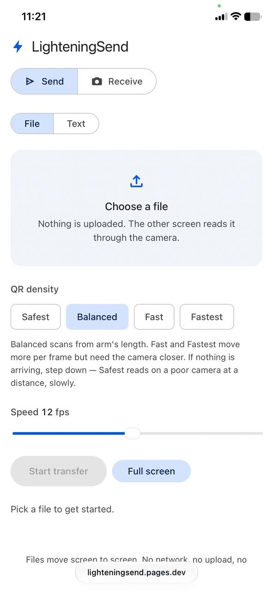
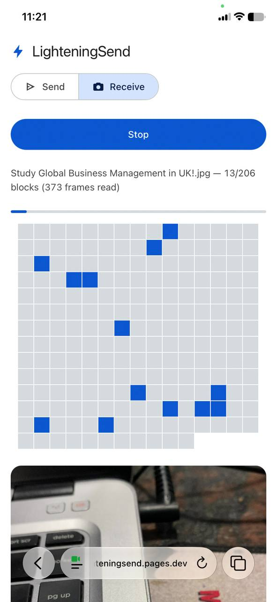

# LighteningSend

Transfer files between two devices with no network, using animated QR codes: one screen displays them, the other's camera reads them.

This is a fork of [mohankumarelec/airgapped-qr-code-transfer](https://github.com/mohankumarelec/airgapped-qr-code-transfer), rewritten with zero third-party CDNs, native gzip streams instead of pako, raw binary QR frames, and CRC32-checked transfers.

## What's been improved

### Real-camera reliability
- **Frames now actually decode through a camera.** The old 768-byte default produced a version-22 QR that a phone could not resolve (≈3 px per module at arm's length), and error correction had been dropped to L on the mistaken theory that the CRC was enough. Error correction is back to **M**, and the default chunk is **384 bytes**.
- **Honest density ladder** labelled by cost, not size: **Safest 64 / Balanced 384 / Fast 768 / Fastest 1280**. Safest is the only size that still decodes 100% from a distant, shaky 720p camera view; Fast and Fastest need the camera closer. Measured with `camera-sim.html`, which simulates a real camera — scaled, blurred, tilted, noised.
- **CRC on every data frame** drops bad camera reads instead of accepting them; the whole compressed stream carries its own CRC too, checked before the file is written.

### Faster receiving
- **Scan buffer shrunk 1600 → 960 px**: decode accuracy unchanged at every distance, but scan cost drops 59.7 → 22.9 ms per frame. Measured end-to-end: **13 → 34 decodes/s (2.65x)** on a replayed camera frame. On a phone (several times slower than a desktop) the old buffer put the receiver below the sender's frame rate, so most frames were never looked at.
- **Full screen button** hands the QR the entire display — density is limited by pixels-per-module at the camera, and the code used to be confined to the 640 px reading column. This is what makes Fast and Fastest usable: at arm's length even 2048 B decodes 100% once the code is big enough.
- **Default 8 → 12 fps, ceiling 20 → 24 fps**, now that the receiver can keep up.

### Cheaper rendering
- **QR draw is 12x cheaper**: one `fillRect` per dark module cost 2.03 ms on a version-15 code; painting one pixel per module into `ImageData` and blitting with smoothing off costs 0.17 ms — on every frame shown. The blit is pixel-exact and still decodes 10/10 through a blurred, tilted camera view (`bench2.html`).
- **The receiver's block mosaic only repaints newly solved blocks** (was: all 2000 on every frame, 1.3 ms) **and rebuilds the grid once per transfer** (was: roughly every 16 frames). One rebuild per transfer, measured.

### Text sending
- **Send text instead of a file** — a Wi-Fi password, an SSH key, a link. Same pipeline (gzip → chunk → fountain → CRC), one flag byte in the header; the receiver shows it on screen instead of saving a download.
- **Clipboard on both ends**: "Paste from clipboard" on the sender, "Copy" on the receiver, with fallbacks for browsers that deny the async clipboard API.
- Text over 100,000 characters downloads as `message.txt` instead of rendering, so a large payload can't lock the tab.

### UI
- **Redesigned in Material 3**: light-blue-grey surface family, segmented Send/Receive toggle, filter chips for QR density, filled pill primary action, 4 px determinate progress track, Material easing. Light and dark themes are tokenised; the QR keeps a white field in either because it has to scan.
- **No more idle video element**: the viewfinder stays hidden until a camera stream is attached, and hides again on stop (the old `<video>` rendered as an empty play box before Start).
- **Fixed a specificity bug the redesign exposed**: `main > section` / `.stage` display rules beat the `hidden` attribute, so the Receive panel rendered underneath Send; `[hidden]` is now enforced globally.
- **Block mosaic reads its colours from CSS custom properties** instead of hardcoded hex, so it follows the theme.

### Reliability of the transfer itself
- **Systematic LT fountain coding**: after the first pass the sender emits repair symbols forever, each the XOR of a pseudo-random block set derived from the frame id alone — nothing extra travels on the wire. Frames can arrive in any order, a missed one never has to come round again, and any `k(1+ε)` frames finish the transfer. Measured overhead 1.16–1.38x the useful frame count at 20–50% loss, vs ≈2.7x for a plain repeating loop at 50%.
- Received filenames are sanitised; decompression is capped against decompression bombs.
- Sender and receiver tuning knobs: chunk size (density) and fps — step both down if the camera is struggling.

## Screenshots

| Send | Receive |
| --- | --- |
|  |  |

## How it works

A single page at the root URL, with two modes: **Send** and **Receive**. Send
takes either a file or a typed message.

- **Send**: pick a file. It's gzipped with the browser's native `CompressionStream`, split into chunks, and each chunk is encoded as a QR code carrying raw binary (QR byte mode — no base64 overhead). The first pass sends every block once, so a clean transfer costs exactly one frame per block.
- **Receive**: point the camera at the sender's screen. Frames are collected in any order, and a missed one never has to come round again — see fountain coding above.
- Two tuning knobs on the send side: chunk size (QR density) and frames per second. Lower both if the receiver is struggling to keep up.

## Dependencies

Fully vendored under `vendor/` — no CDNs, works offline (open it from a USB stick):

- [qrcode-generator](https://github.com/kazuhikoarase/qrcode-generator) 1.4.4 — QR encoding
- [@undecaf/zbar-wasm](https://github.com/undecaf/zbar-wasm) 0.11.0 — QR decoding (WebAssembly)

Compression/decompression uses the browser-native `CompressionStream` / `DecompressionStream` gzip APIs. No pako.

## Browser requirements

Needs `CompressionStream` and WebAssembly:

- Chrome/Edge 103+
- Safari 16.4+ (iOS 16.4+)
- Firefox 113+

Camera access requires HTTPS (or `localhost`).

## Files

- `index.html` — the app
- `app.js`, `app.css` — logic and styling
- `vendor/` — vendored dependencies
- `_headers` — Cloudflare Pages security headers
- `build.mjs` — minifies into `dist/` for deploy; the unbuilt repo still runs as-is
- `test.mjs` — protocol and fountain self-check: `npm test`
- `test.html` — QR encode/decode round-trip check; serve the directory and open it in a browser
- `camera-sim.html` — decode-rate bench through a simulated camera (scaled, blurred, tilted, noised)
- `bench.html` — decode-rate vs scan-buffer-size bench
- `bench2.html` — per-frame render-cost bench on both ends

## Deployment

Cloudflare Pages, static, no server:

```sh
npm ci
npm test
npm run deploy    # builds dist/ and uploads it
```

The build only minifies; `dist/` has the same layout as the source, so opening
`index.html` straight from the repo works identically.

## License

MIT — see [LICENSE](LICENSE).

## Credits

- [mohankumarelec/airgapped-qr-code-transfer](https://github.com/mohankumarelec/airgapped-qr-code-transfer) — upstream project this was forked from.
- [qrcode-generator](https://github.com/kazuhikoarase/qrcode-generator) — MIT License.
- [@undecaf/zbar-wasm](https://github.com/undecaf/zbar-wasm) — LGPL-2.1 License.
